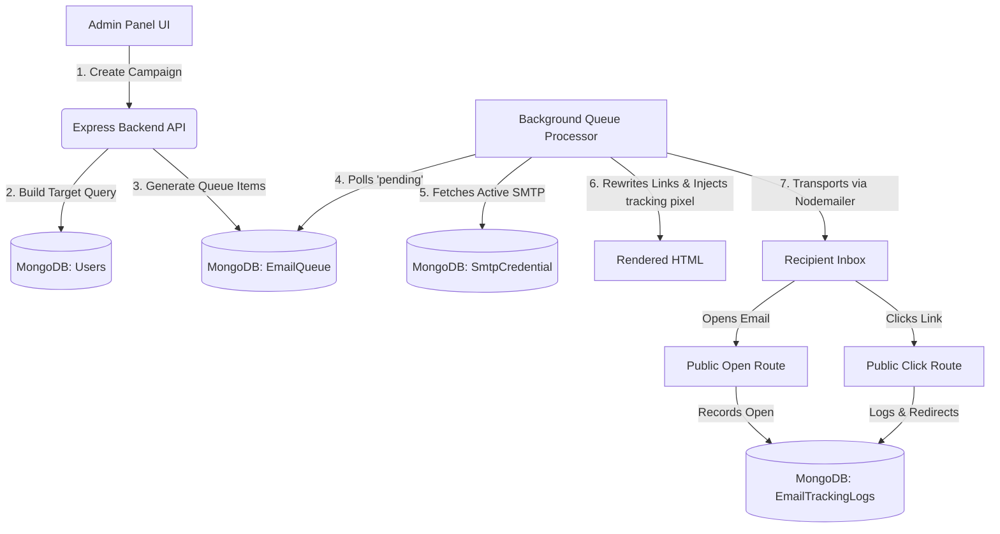

# HeartEcho Email Marketing Feature Documentation

This document outlines the architecture, database schemas, API routes, backend logic, and frontend components of the **Email Marketing & Admin Panel** feature built for HeartEcho. This documentation is designed to allow a developer to recreate the exact feature in a local-development environment.

---

## 1. Feature Overview & Flow

The email marketing feature is designed to manage bulk promotional email distributions to HeartEcho users (e.g., free tier users, subscribers, inactive users) while avoiding spam flags and managing delivery rates.



### Key Workflow Actions
1. **SMTP Rotation**: Instead of sending all emails through a single account, the system rotates between multiple admin-defined SMTP credentials to balance the load and respect daily quotas.
2. **Dynamic Segments**: Campaigns target specific cohorts of users dynamically using database queries (e.g., users registered today, inactive users, free tier only).
3. **Open Tracking**: An invisible 1x1 tracking image is injected into the HTML. When loaded by the email client, it calls a backend tracking endpoint.
4. **Click Tracking**: Every link in the email body is rewritten dynamically to route through a redirection endpoint on the server, which records the link click before sending the user to their destination.
5. **Conversion Tracking**: When a user purchases a subscription, the system checks for any marketing email clicks in the last 7 days and credits the purchase to that campaign.

---

## 2. Database Models (Mongoose)

### A. SmtpCredential (`Server/models/SmtpCredential.js`)
Stores SMTP credentials. Multiple active credentials will be rotated by the processor.
```javascript
const mongoose = require("mongoose");

const smtpCredentialSchema = new mongoose.Schema({
  email: { type: String, required: true, unique: true },
  pass: { type: String, required: true }, // SMTP app password (e.g., Google App Passwords)
  host: { type: String, default: "smtp.gmail.com" },
  port: { type: Number, default: 465 },
  secure: { type: Boolean, default: true },
  limitDaily: { type: Number, default: 100 }, // Quota limit per credential
  emailsSentToday: { type: Number, default: 0 },
  lastSentAt: { type: Date, default: null },
  active: { type: Boolean, default: true },
  errorMessage: { type: String, default: "" }
}, { timestamps: true });

module.exports = mongoose.model("SmtpCredential", smtpCredentialSchema);
```

### B. EmailTemplate (`Server/models/EmailTemplate.js`)
Stores pre-designed HTML email templates with placeable tags (e.g., `{{first_name}}`, `{{email}}`, `{{offer_end_date}}`).
```javascript
const mongoose = require("mongoose");

const emailTemplateSchema = new mongoose.Schema({
  name: { type: String, required: true, unique: true }, // System ID (e.g., 'welcome')
  label: { type: String, required: true }, // Display name (e.g., '👋 Welcome Email')
  subject: { type: String, required: true },
  html: { type: String, required: true }, // Complete HTML template with custom CSS styles
  isActive: { type: Boolean, default: true }
}, { timestamps: true });

module.exports = mongoose.model("EmailTemplate", emailTemplateSchema);
```

### C. EmailCampaign (`Server/models/EmailCampaign.js`)
Tracks the status and metrics of individual email campaigns.
```javascript
const mongoose = require("mongoose");

const emailCampaignSchema = new mongoose.Schema({
  name: { type: String, required: true },
  template: { type: mongoose.Schema.Types.ObjectId, ref: "EmailTemplate", required: true },
  status: { type: String, enum: ["draft", "scheduled", "sending", "completed", "paused", "failed"], default: "draft" },
  targetAudience: { 
    type: String, 
    enum: [
      "all", "free", "subscribers", 
      "new_users_today", "new_users_7d", 
      "free_today", "free_7d", 
      "subscribers_today", "subscribers_7d", 
      "free_no_chat", "free_chatted_no_sub", 
      "inactive_7d", "inactive_30d", 
      "specific_user"
    ], 
    default: "all" 
  },
  targetValue: { type: String }, // Used to store specific user email if targetAudience === 'specific_user'
  scheduledAt: { type: Date, default: Date.now },
  totalRecipients: { type: Number, default: 0 },
  sentCount: { type: Number, default: 0 },
  openCount: { type: Number, default: 0 },
  clickCount: { type: Number, default: 0 },
  conversionCount: { type: Number, default: 0 }
}, { timestamps: true });

module.exports = mongoose.model("EmailCampaign", emailCampaignSchema);
```

### D. EmailQueue (`Server/models/EmailQueue.js`)
Stores individual email records waiting to be dispatched.
```javascript
const mongoose = require("mongoose");

const emailQueueSchema = new mongoose.Schema({
  campaign: { type: mongoose.Schema.Types.ObjectId, ref: "EmailCampaign", required: false },
  user: { type: mongoose.Schema.Types.ObjectId, ref: "User", required: false },
  toEmail: { type: String, required: true },
  subject: { type: String, required: true },
  html: { type: String, required: true },
  status: { type: String, enum: ["pending", "sending", "sent", "failed"], default: "pending" },
  smtpCredential: { type: mongoose.Schema.Types.ObjectId, ref: "SmtpCredential", required: false },
  error: { type: String, default: "" },
  trackingId: { type: String, required: true, unique: true }, // Matches tracking logs
  sentAt: { type: Date, default: null }
}, { timestamps: true });

module.exports = mongoose.model("EmailQueue", emailQueueSchema);
```

### E. EmailTrackingLog (`Server/models/EmailTrackingLog.js`)
Logs opens, clicks, and conversions.
```javascript
const mongoose = require("mongoose");

const emailTrackingLogSchema = new mongoose.Schema({
  trackingId: { type: String, required: true },
  campaign: { type: mongoose.Schema.Types.ObjectId, ref: "EmailCampaign", required: false },
  user: { type: mongoose.Schema.Types.ObjectId, ref: "User", required: false },
  email: { type: String, required: true },
  action: { type: String, enum: ["open", "click", "conversion"], required: true },
  ip: { type: String },
  userAgent: { type: String },
  clickedUrl: { type: String }, // Populated if action === 'click'
  timestamp: { type: Date, default: Date.now }
}, { timestamps: true });

// Setup indexes for reporting speed
emailTrackingLogSchema.index({ trackingId: 1, action: 1 });
emailTrackingLogSchema.index({ user: 1, action: 1 });

module.exports = mongoose.model("EmailTrackingLog", emailTrackingLogSchema);
```

---

## 3. API Routing (`Server/routes/emailMarketingRoutes.js`)

The routes are split into public endpoints (no auth needed for tracking) and protected endpoints (admin only).

```javascript
const express = require("express");
const controller = require("../controllers/emailMarketingController");
const authMiddleware = require("../middleware/authMiddleware"); // Validates admin JWT token

const router = express.Router();

// Public Tracking Links
router.get("/track/open/:trackingId", controller.emailOpen);
router.get("/track/click/:trackingId", controller.emailClick);

// Protected Admin Operations
router.get("/dashboard", authMiddleware, controller.getMarketingStats);
router.get("/search-users", authMiddleware, controller.searchUsers);
router.get("/test-render-smtp", controller.testRenderSmtp); // Diagnostic endpoint

// SMTP CRUD and Verification
router.get("/smtp", authMiddleware, controller.getSmtpCredentials);
router.post("/smtp", authMiddleware, controller.createSmtpCredential);
router.put("/smtp/:id", authMiddleware, controller.updateSmtpCredential);
router.delete("/smtp/:id", authMiddleware, controller.deleteSmtpCredential);
router.post("/smtp/:id/test", authMiddleware, controller.testSmtpCredential);

// Template CRUD
router.get("/templates", authMiddleware, controller.getTemplates);
router.post("/templates", authMiddleware, controller.createTemplate);
router.put("/templates/:id", authMiddleware, controller.updateTemplate);
router.delete("/templates/:id", authMiddleware, controller.deleteTemplate);

// Campaign CRUD and Trigger
router.get("/campaigns", authMiddleware, controller.getCampaigns);
router.post("/campaigns", authMiddleware, controller.createCampaign);
router.get("/campaigns/:id", authMiddleware, controller.getCampaignDetails);
router.delete("/campaigns/:id", authMiddleware, controller.deleteCampaign);

module.exports = router;
```

---

## 4. Background Processor Engine (`Server/utils/emailQueueProcessor.js`)

The background processor runs continuously to fetch and dispatch pending emails.

### Key Logic Steps in the Engine:
1. **Startup Recovery**: On startup, any emails stuck in `sending` status are reset to `pending` with an error message to prevent them from hanging forever.
2. **Loop & Delays**: Loop runs indefinitely. When an email is sent, it waits `4000ms` (4 seconds) before sending the next one to protect server IP reputation. If no emails are in the queue, it waits `10000ms` (10 seconds) before polling again.
3. **SMTP Load Balancing**: 
   - Queries all active `SmtpCredential` entries.
   - Filters out credentials that have hit their `limitDaily`.
   - Sorts SMTPs by `lastSentAt` ascending (oldest sent first) to round-robin rotate them.
   - If no database credentials exist, falls back to environment variables (`EMAIL_USER`, `EMAIL_PASS`).
4. **HTML Compilation**:
   - Compiles template placeholders: `{{first_name}}`, `{{email}}`, `{{offer_end_date}}` (formatted to Indian Standard Time context).
   - Injects the `1x1` pixel before the `</body>` tag:
     ``
   - Rewrites all body link anchors to route to `/track/click`:
     `/api/v1/api/email-marketing/track/click/${trackingId}?url=${encodeURIComponent(originalUrl)}`
5. **Nodemailer Transport**: Dispatches the message and flags the queue item as `sent` or `failed` (logging the exact stack/errorMessage in the database). If authorization fails, it immediately deactivates the SMTP credential to prevent continuous login attempts.

---

## 5. Analytics & Conversion Hook (`Server/controllers/userController.js`)

To attribute subscription purchases to marketing campaigns, add this validation block inside the database transaction/callback where payment is verified and saved:

```javascript
// Inside userController.paymentSave after confirming subscription upgrade
try {
  const EmailTrackingLog = require("../models/EmailTrackingLog");
  const EmailCampaign = require("../models/EmailCampaign");

  const sevenDaysAgo = new Date();
  sevenDaysAgo.setDate(sevenDaysAgo.getDate() - 7);

  // Look for any links clicked by this user in the last 7 days
  const recentClick = await EmailTrackingLog.findOne({
    user: userId,
    action: "click",
    timestamp: { $gte: sevenDaysAgo }
  }).sort({ timestamp: -1 });

  if (recentClick) {
    // Prevent duplicate attribution for the same tracking item
    const conversionExists = await EmailTrackingLog.findOne({
      trackingId: recentClick.trackingId,
      action: "conversion"
    });

    if (!conversionExists) {
      await EmailTrackingLog.create({
        trackingId: recentClick.trackingId,
        campaign: recentClick.campaign,
        user: userId,
        email: existingUser.email,
        action: "conversion",
        clickedUrl: recentClick.clickedUrl
      });

      // Increment campaign stats
      if (recentClick.campaign) {
        await EmailCampaign.findByIdAndUpdate(recentClick.campaign, {
          $inc: { conversionCount: 1 }
        });
      }
    }
  }
} catch (campaignErr) {
  console.error("Email campaign conversion tracking error:", campaignErr);
}
```

---

## 6. Default Templates Seeding (`Server/utils/seedTemplates.js`)

To ensure standard HTML layouts are populated automatically upon application startup, configure a templates seeder:

1. Define a list of core campaigns:
   - `welcome`: Sent upon registration, provides an overview of features and redirects users to pick an AI persona.
   - `followup24`: Sent 24 hours post-registration if they haven't sent a message, highlighting character interactions (e.g. "Priya sent you a message").
   - `winback`: Sent 7 days post-inactivity, offering bonus messages.
   - `upgrade`: Sent once free limits are reached, showing subscription options.
   - `trial` / `churn` / `offer` / `newpersona`: Custom seasonal/discount promotional messages.
2. Embed premium CSS designs with:
   - Fonts (Google Font: *Playfair Display*, *DM Sans*).
   - Glassmorphism borders and vibrant pink/purple styling.
   - Distinctive CTA buttons, timeline statistics panels, and review quotes.
3. Import and execute `seedTemplates()` inside your `server.js` startup file.

---

## 7. Frontend Admin Panel (`Client/src/pages/Admin/EmailMarketingAdmin.jsx`)

The management panel UI provides full administrative control.

### Core Sections & Tabs
1. **Campaigns & Analytics Tab**:
   - Key Metric Indicators: Sent count, unique opens, click-through rates, conversion metrics.
   - Target Segments Selector: Select target audience (e.g. inactive 7 days, chats initiated but unsubscribed, specific user search).
   - Autocomplete User Search: If targeting a single user, queries `/search-users` on keydown to display a list of matches, enabling precise targeting.
   - Past Campaigns Table: Displays stats for all launched campaigns, including calculated rates and options to delete campaigns.
2. **Email Templates Tab**:
   - List of seeded templates on the left sidebar.
   - Raw HTML markup textarea editor.
   - **Find & Replace Tool**: Implements basic find-next, replace, and replace-all patterns with selection highlight inside the editor.
   - **Live Sandbox Preview**: Uses an `iframe` with `srcDoc` to render the compiled email content in real time.
3. **SMTP Configuration Tab**:
   - Forms to add new credentials (email, password, SMTP host, secure connection setting, daily limit).
   - SMTP Health check utility: Includes a "Test SMTP Connection" button that calls the `/smtp/:id/test` endpoint to send a test email.

---

## 8. Local Setup Instructions

### Environment Variables
Configure the following in the local `.env` server file:
```env
# URL where your express server is running
BACKEND_URL=http://localhost:5000

# Fallback email configuration if no SMTP credentials are added to MongoDB
EMAIL_USER=heartecho.subscribe@gmail.com
EMAIL_PASS=your_gmail_app_password
```

### Gmail Connection Setup (Local)
To send emails through Gmail locally:
1. Enable **Two-Factor Authentication (2FA)** on the Gmail account.
2. Go to **Google Account Settings** > **Security** > **App Passwords**.
3. Generate a new App Password (select "Other" and name it e.g., "HeartEcho Local").
4. Copy the 16-character generated key (without spaces) and use it as the SMTP password.

### Daily Reset Scheduler
Configure a Cron job (`node-cron`) to run at midnight to reset the daily email count limit on all SMTP accounts so they can send emails again:
```javascript
const cron = require("node-cron");
const SmtpCredential = require("./models/SmtpCredential");

cron.schedule("0 0 * * *", async () => {
  try {
    await SmtpCredential.updateMany({}, { $set: { emailsSentToday: 0 } });
    console.log("Reset daily SMTP limits successfully.");
  } catch (error) {
    console.error("Failed to reset daily SMTP limits:", error);
  }
});
```
